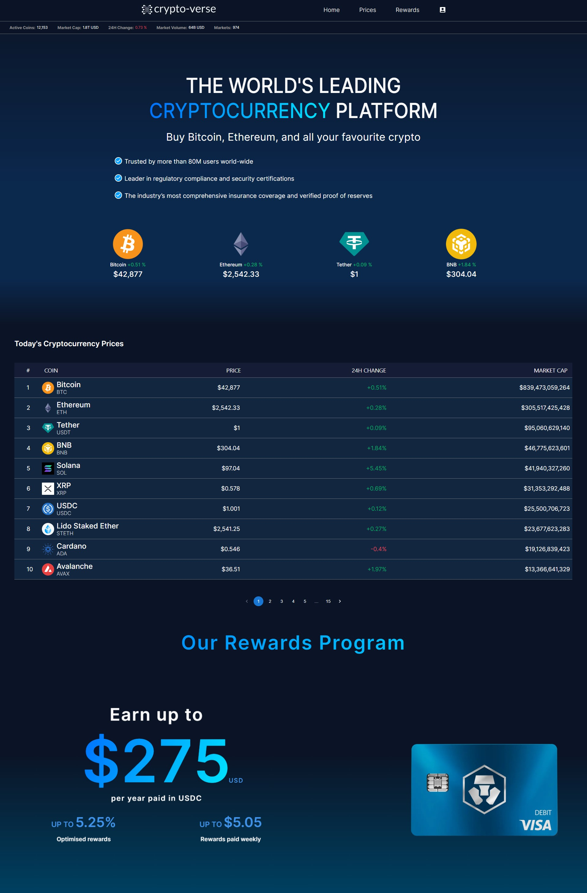
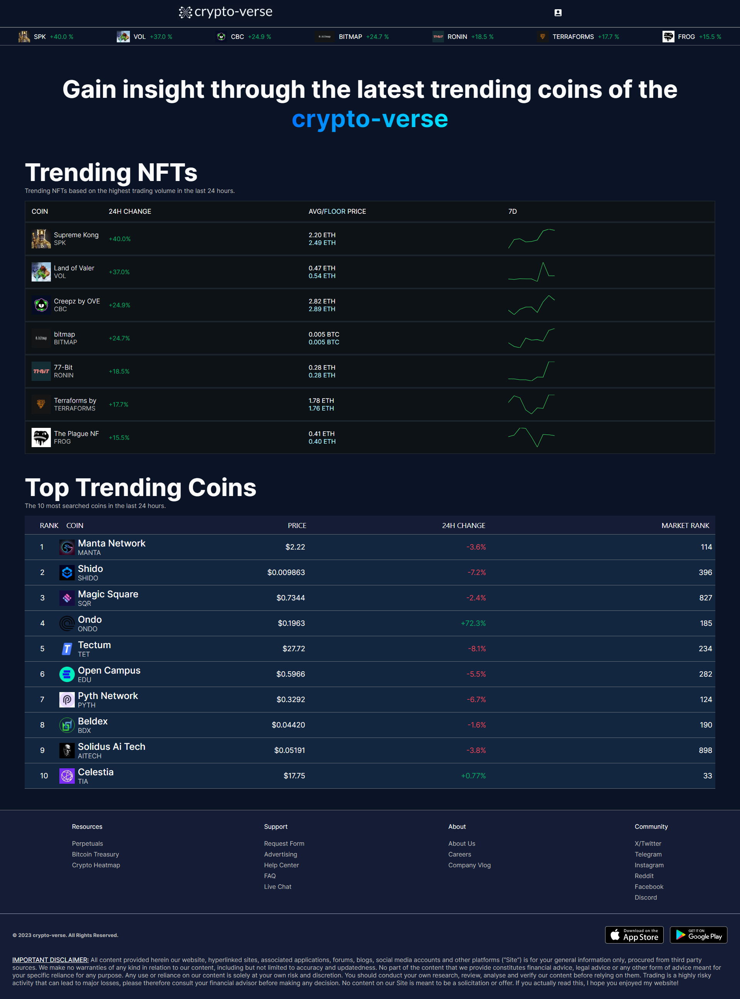

# [Crypto-verse](https://crypto-net-ten.vercel.app/): A Cryptocurrency App 

Author: Ryan Freas

Created: November 18, 2023

Frontend: React, SCSS

Backend: MongoDB, Express, Node

Crypto-verse is a cryptocurrency app that displays the latest crypto data, including the total market volume, 24H change, and information about various coins such as Bitcoin and Ethereum. The app also allows users to create an account, where they can add different currencies to their portfolio for later viewing. The API used to fetch the coin data is CoinGecko, which has a limit of 20 requests/minute. 

Crypto-verse also incorporates unit testing with Jest, React Three Fiber, and Framer Motion. Ideas such as storing state in the URL are also explored.

The app is still undergoing updates, focusing on improvements in accessibility, speed optimization, SEO, and more.

| METHOD:    URL:                                        // DESCRIPTION                                    |
|----------------------------------------------------------------------------------------------------------|
| GET:       https://crypto-api-epz8.onrender.com/                              // Ping and wake up server    |
| GET:       https://crypto-api-epz8.onrender.com/api/portfolio/                // get all coins in portfolio |
| POST:      https://crypto-api-epz8.onrender.com/api/portfolio/                // add coin to portfolio      |
| DELETE:    https://crypto-api-epz8.onrender.com/api/portfolio/:id             // delete coin from portfolio |
| POST:      https://crypto-api-epz8.onrender.com/api/user/signup/              // create account             | 
| POST:      https://crypto-api-epz8.onrender.comp/api/user/login/              // login to account           |

The frontend of this app is hosted on [Vercel](https://vercel.com/) and the backend is hosted on [Render.com](https://render.com/)

Home Page:

Trending Page:

Hosted backend can be found at this repo: https://github.com/ryan2625Backup/crypto-net/tree/backend-test

Link: [crypto-verse](https://crypto-net-ten.vercel.app/)
